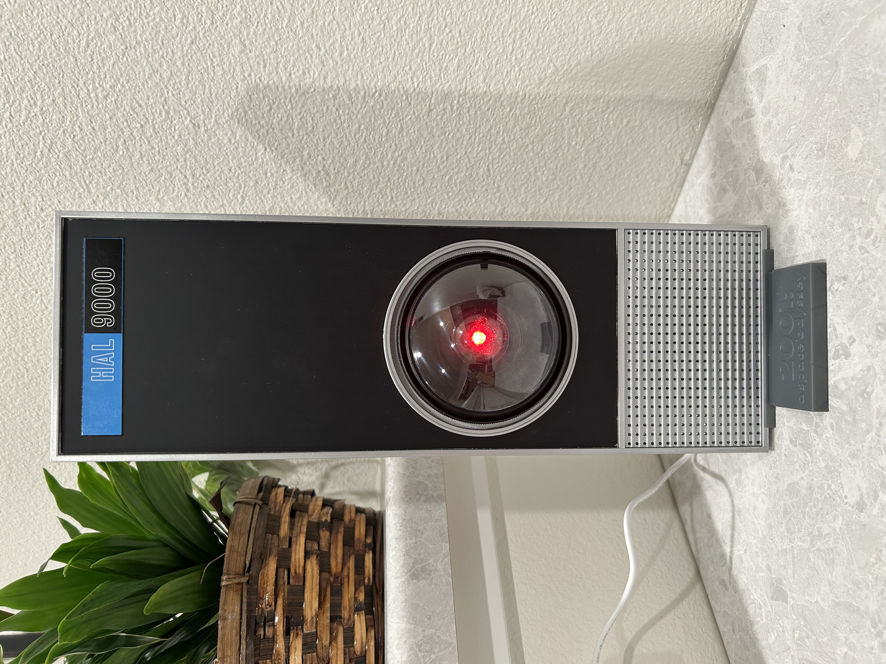
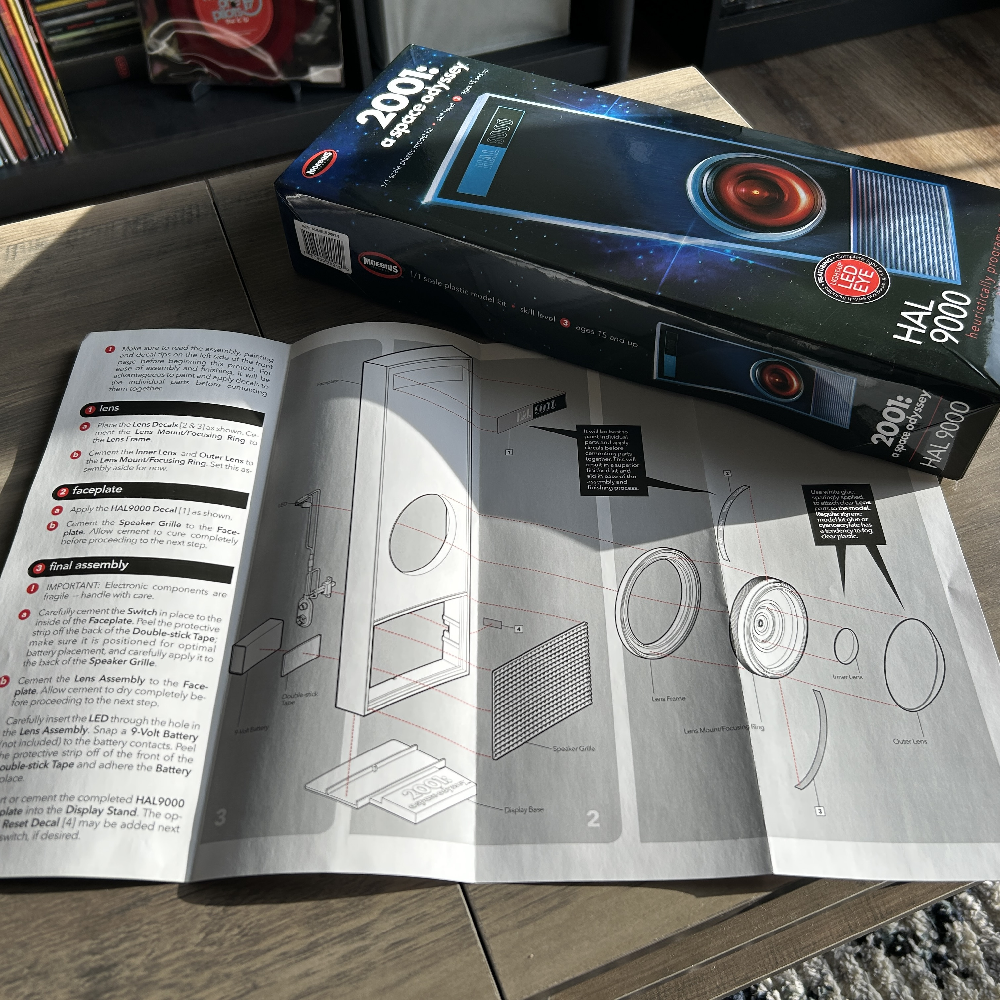
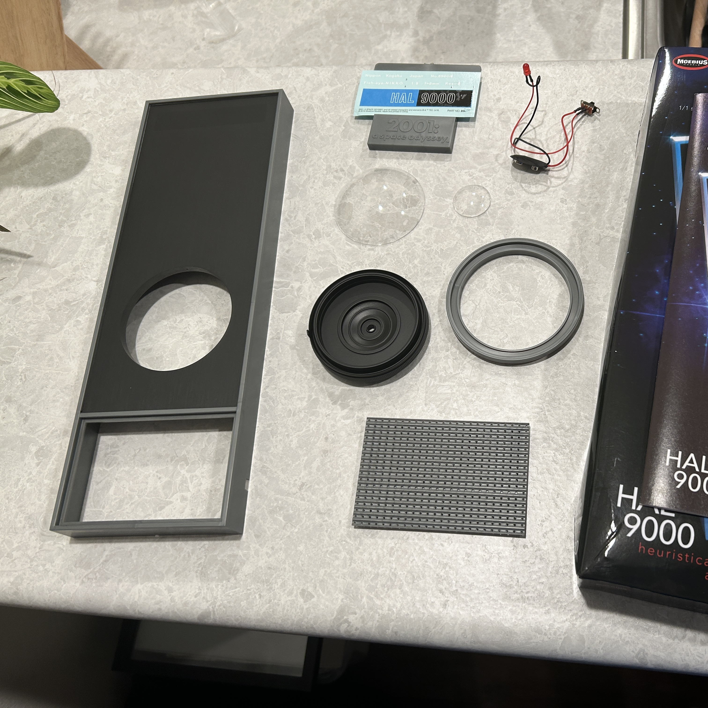
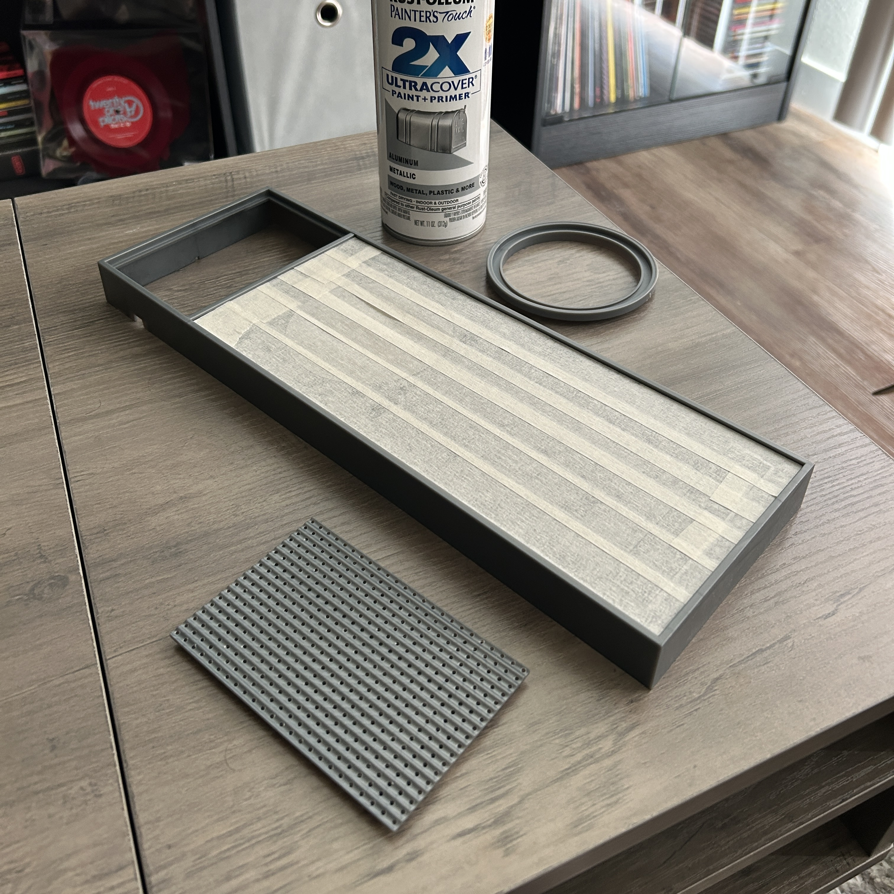
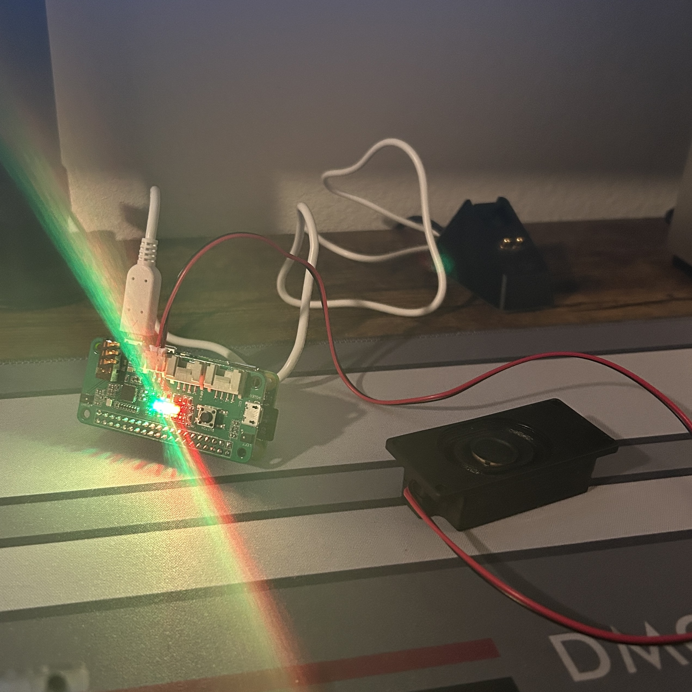
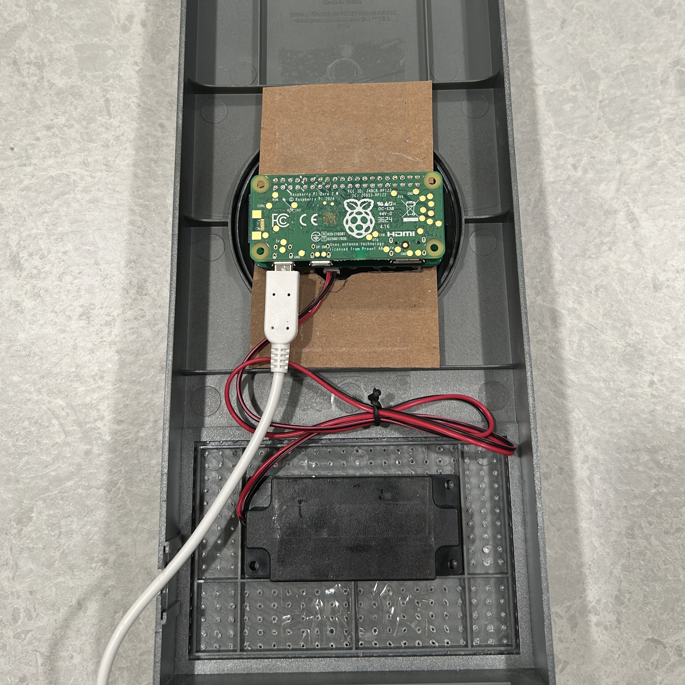

# Hal 9000 Voice Assistant

<table>
  <tr>
    <td width="33%">
      
    </td>
    <td>
      <p>
        A voice-activated AI assistant modeled after HAL 9000 from <em>2001: A Space Odyssey</em>.
      </p>
      <p>
        The assistant is built using a Raspberry Pi Zero 2 W, integrated with dual microphones, a speaker, and status LEDs - all housed within a 1:1 scale HAL 9000 model kit.
      </p>
      <p>
        The system activates on the wake phrase “Hey HAL” using <a href="https://github.com/Picovoice/porcupine">Porcupine</a> for local wake word detection and processes spoken input using fully self-hosted services for speech-to-text (<a href="https://github.com/alphacep/vosk-server">Vosk</a>), language generation (<a href="https://github.com/ollama/ollama">Ollama</a>), and text-to-speech (<a href="https://github.com/rhasspy/piper">Piper</a>). The text-to-speech voice is custom-trained using samples from the film to closely match HAL’s original tone.
      </p>
      <p>
        A demo of the voice assistant can be viewed <a href="#demo">here</a>.
      </p>
    </td>
  </tr>
</table>

## Table of Contents
- [Project Overview](#project-overview)
  - [Hardware](#hardware)
  - [Software](#software)
  - [How it Works](#how-it-works)
- [Prerequisites](#prerequisites)
- [Installation](#installation)
- [Demo](#demo)
- [Model Assembly](#model-assembly)
- [Notes](#notes)

## Project Overview

This project combines the following hardware and software components:

### Hardware

- [**Raspberry Pi Zero 2 W**](https://www.raspberrypi.com/products/raspberry-pi-zero-2-w/) - The voice assistant's main computer. Runs the Python assistant script and handles communication with STT/LLM/TTS services via local network.
- [**ReSpeaker 2-Mics Pi Hat**](https://www.seeedstudio.com/ReSpeaker-2-Mics-Pi-HAT.html?srsltid=AfmBOooVBplsE1S27Ix879C-gS0P7OQUHIdzmybpualjSxRoyzHZtlWk) - Provides two onboard microphones, a JST 2.0 speaker output, and three programmable LEDs.
- [**adafruit Mono Enclosed Speaker (1W 8 Ohm)**](https://www.adafruit.com/product/5986) - Compatible speaker with JST 2.0 connector, used for audio output.
- [**Moebius Models HAL 9000 1:1 Scale Model Kit**](https://a.co/d/a20T0uZ) - Enclosure used to house hardware, modeled after HAL 9000 from *2001: A Space Odyssey*.
- **Homelab Server** – Hosts all compute-heavy services (speech-to-text, language generation, and text-to-speech) over the LAN. Provides fast, local, offline processing with no reliance on cloud services.  
  - **OS:** Proxmox VE running Ubuntu Server VM  
  - **CPU:** Intel Core i5-8400  
  - **RAM:** 16 GB DDR4  
  - **GPU:** NVIDIA GeForce GTX 1060 6GB (used for LLM acceleration and Piper TTS training)  
  - **Storage:** 50 GB SSD allocated to VM  

### Software

- [**Porcupine**](https://github.com/Picovoice/porcupine) - Used for "Hey Hal" wake word detection, which runs locally on the Raspberry Pi Zero 2 W.
- [**Vosk**](https://github.com/alphacep/vosk-server) - Speech-to-text server used to transcribe recorded voice input into text.
- [**Ollama**](https://github.com/ollama/ollama) - Runs the LLM used for generating responses.
  - It uses the latest [llama3](https://ollama.com/library/llama3) model, featuring 8 billion parameters.
- [**Piper**](https://github.com/rhasspy/piper) - Text-to-speech engine that converts text into audible speech in real-time. Also used to train a Hal 9000 text-to-speech model using audio samples from the film.
  - The HAL 9000 .onnx speech-to-text model can be found on my [HuggingFace](https://huggingface.co/campwill/HAL-9000-Piper-TTS), along with its corresponding [dataset](https://huggingface.co/datasets/campwill/HAL-9000-Speech).

### How it Works

The voice assistant is driven by a sequence of self-hosted services, coordinated through a Python script (`app.py`) running on a Raspberry Pi Zero 2 W.

The assistant runs continuously in a listening state, waiting for the wake phrase “Hey HAL.” Wake word detection is handled locally on the Raspberry Pi using Porcupine. When the phrase is recognized, the system begins actively recording voice input until a silence threshold is met. The recorded audio is then sent over the local network to my homelab server, where it is first transcribed by a speech-to-text service (Vosk). The transcribed text is then passed to a large language model (Ollama), which generates a textual response. This response is then sent to a text-to-speech engine (Piper), which synthesizes speech audio. The audio is streamed back to the Raspberry Pi and played through the speaker, enabling a fully self-hosted, offline voice interaction.

The process is illustrated below:


## Prerequisites

Before setting up the assistant, ensure the following conditions are met:

- A Raspberry Pi Zero 2 W is set up and connected to the same local network as your server.
- A ReSpeaker 2-Mics Pi Hat is correctly installed and initialized on the Raspberry Pi. Follow the driver setup instructions for the hat on seeed studio's [website](https://wiki.seeedstudio.com/ReSpeaker_2_Mics_Pi_HAT_Raspberry/).
- A separate computer or server must be available on the same network to host the required backend services:

### Vosk

The easiest way to run Vosk is by running the WebSocket server using Docker:

```bash
docker run -d -p 2700:2700 alphacep/kaldi-en:latest
```

More information for running the server can be found on the [official documentation](https://alphacephei.com/vosk/server) for Vosk. Ensure Vosk is running the WebSocket server on port 2700.

### Ollama

Ollama can be installed using the following command:

```bash
curl -fsSL https://ollama.com/install.sh | sh
```

By default, Ollama runs on port 11434. Once Ollama is installed, you will need to run a large language model of your choosing. For this project, I used the latest [llama3](https://ollama.com/library/llama3) model, featuring 8 billion parameters.

```bash
ollama run llama3:latest
```

If you decide to use a different model, you will need to change the `OLLAMA_MODEL` constant in `app.py`.

### Piper

To set up the Piper Python HTTP server, I recommend following Thorsten-Voice's tutorial on [YouTube](https://www.youtube.com/watch?app=desktop&v=pLR5AsbCMHs). He provides excellent resources for setting up a Piper TTS environment, as well as training your own voices. More information on Piper can be found on their [GitHub](https://github.com/rhasspy/piper). Ensure Piper is running the HTTP server on port 5000. 

If you'd like to use a custom text-to-speech model, you can run the HTTP server with my custom HAL 9000 model, available on my [HuggingFace](https://huggingface.co/campwill/HAL-9000-Piper-TTS) page. Alternatively, you can train your own model using the corresponding [dataset](https://huggingface.co/datasets/campwill/HAL-9000-Speech).

## Installation

With all the services running on their respective ports (Vosk, Ollama, and Piper), the Raspberry Pi client can be set up.

### 1. Clone the Repository

```bash
clone https://github.com/campwill/hal-voice-assistant.git
cd hal-voice-assistant
```

### 2. Set Up Python Virtual Environment

Create the virtual environment and install all the required dependencies.

```bash
python3 -m venv .venv
source .venv/bin/activate
pip install -r requirements.txt
```

### 3. Configure Audio Device

In `app.py`, set the correct device index for your ReSpeaker 2-Mics Pi Hat:

```python
RESPEAKER_INDEX = 1 # Change to your specific device index
```

To find the device index for your audio device:

```bash
arecord -l
```

### 4. Create a `.env` File
Create a .env file in the root of the project:

```bash
nano .env
```
```env
PICOVOICE_KEY=your_picovoice_api_key
PICOVOICE_MODEL_PATH=/absolute/path/to/your/model.ppn
```
Get your Picovoice API key and your Porcupine wake word model (.ppn) from [Picovoice Developer Console](https://console.picovoice.ai/login).

### 5. Run the Voice Assistant
```bash
python app.py
```
The Python script can be ran as a service to start automatically once the Raspberry Pi turns on. More information about running scripts on startup can be found [here](https://www.dexterindustries.com/howto/run-a-program-on-your-raspberry-pi-at-startup/#systemd).

## Demo

<div align="center">
  <video src="https://github.com/user-attachments/assets/67f65348-41fb-4b91-9165-7fa656c89429">
    Your browser does not support the video tag.
  </video>
</div>

## Model Assembly

For the physical enclosure of my voice assistant, I used the [Moebius Models HAL 9000 1:1 Scale Model Kit](https://a.co/d/a20T0uZ). This kit arrives as a set of unassembled plastic components. I painted the body with Flat Black for the faceplate and Metallic Aluminum for the frame. For the lens components, I used Elmer’s Glue to secure them without fogging or damaging the clear plastic.

The speaker grill included in the kit was a solid plastic piece with no perforations. To make it functional, I drilled out all of the holes to allow audio to pass through clearly.

Below are some pictures of the assembly process.

<table align="center" width="100%">
  <tr align="center">
    <td>
      
    </td>
    <td>
      
    </td>
    <td>
      
    </td>
  </tr>
  <tr align="center">
    <td>
      
    </td>
    <td>
      
    </td>
    <td>
      
    </td>
  </tr>
</table>

I was able to mount the Raspberry Pi in a position where the LED aligned with HAL 9000’s eye. For now, I used cardboard and tape as a temporary solution (I don't own a 3D printer yet). Below are some pictures of the components mounted inside the model kit.

<table>
  <tr align="center" width="100%">
    <td>
      
    </td>
    <td>
      
    </td>
  </tr>
</table>

## Notes

- I hope to shorten the response time by exploring ways to optimize the Vosk STT pipeline, such as reducing silence detection lag or modifying WebSocket handling.
- Additionally, instead of sending three separate requests to my homelab server, I may create a unified API endpoint that handles the STT, LLM, and TTS stages in a single request to minimize network overhead.
- The audio for the ReSpeaker 2-Mics Pi Hat has also been giving me issues, especially after the Raspberry Pi reboots. I will be tinkering with the ReSpeaker 2-Mics Pi Hat's audio functionality to see if I can fix the volume issues.
